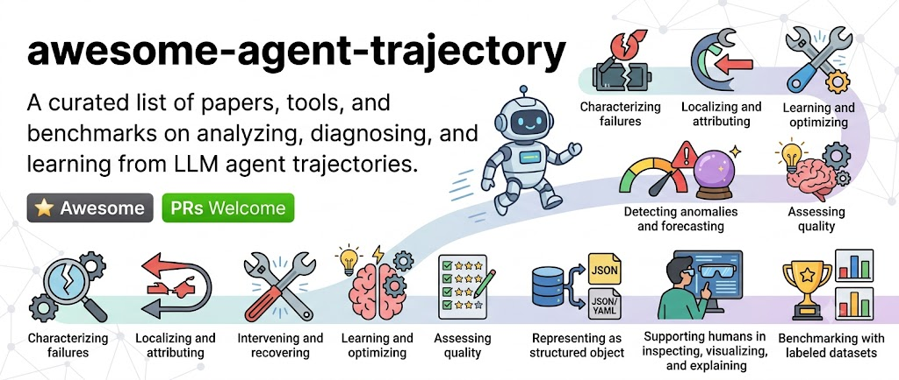

# Awesome-Agent-Trajectory

A curated list of papers, tools, and benchmarks on **analyzing, diagnosing, and learning from LLM agent trajectories**.

This list tracks work across the trajectory-analysis pipeline:

- **Characterizing** how agents behave and where they tend to fail
- **Localizing and attributing** failures to a specific agent, step, or root cause
- **Intervening and recovering** from failures at runtime
- **Learning and optimizing** future behavior from past trajectories
- **Detecting anomalies** and forecasting failure before it happens
- **Assessing the quality** of individual steps or whole trajectories
- **Representing** trajectories as structured, traceable objects
- **Supporting humans** in inspecting, visualizing, and explaining agent behavior
- **Benchmarking** all of the above with labeled datasets

Contributions welcome — see [Contributing](#contributing).

## Table of Contents

1. [Surveys](#surveys)
2. [Empirical Study/Characterization](#empirical-studycharacterization)
3. [Failure Localization, Attribution, and Diagnosis](#failure-localization-attribution-and-diagnosis)
4. [Runtime Intervention, Recovery, and Repair](#runtime-intervention-recovery-and-repair)
5. [Learning and Optimization from Trajectories](#learning-and-optimization-from-trajectories)
6. [Anomaly Detection and Failure Forecasting](#anomaly-detection-and-failure-forecasting)
7. [Trajectory Quality Assessment](#trajectory-quality-assessment)
8. [Trajectory Representation](#trajectory-representation)
9. [Human-Centered Analysis, Visualization, and Explainability](#human-centered-analysis-visualization-and-explainability)
10. [Benchmarks and Datasets](#benchmarks-and-datasets)
  10.1. [Coding Agents](#coding-agents)
  10.2 [General Agents/Mixed](#general-agentsmixed)
  10.3. [Deep-Research Agents](#deep-research-agents)

---

### Surveys 

1. **(arXiv 2026) Agent System Operations: Categorization, Challenges, and Future Directions** [[Paper](https://arxiv.org/abs/2606.01581)]
   — Defines AgentOps around monitoring, anomaly detection, root-cause
   localization, and resolution, with intra-agent and inter-agent anomaly
   taxonomies.
   `survey` `agentops` `agent-debugging`

2. **(arXiv 2026) A Survey for LLM Agent Trajectory Analysis: From Failure Attribution to Enhancement** [[Paper](https://huggingface.co/datasets/RobinChen2001/A-Survey-for-LLM-Agent-Trajectory-Analysis)]
   — Reviews trajectory-based failure taxonomy, attribution, enhancement,
   debugging tools, and benchmarks.
   `survey` `trajectory-analysis`

### Empirical Study/Characterization 

*Empirical research that describes how agents behave and identifies recurring trajectory structures, strategies, and failure patterns.*

1. **(ASE 2025) Understanding Software Engineering Agents: A Study of Thought-Action-Result Trajectories** [[Paper](https://arxiv.org/abs/2506.18824)] [[Code](https://github.com/sola-st/llm-agents-study)]
   — Studies 120 trajectories and 2,822 LLM interactions, identifying recurring motifs, anti-patterns, token-use patterns, and feedback-integration agentic coding behavior.
   `coding agents` `thought-action-result`

2. **(ASE-NIER 2025) Exploring autonomous agents: A closer look at why they fail when completing tasks** [[Paper](https://arxiv.org/pdf/2508.13143)] [[Code](https://github.com/lurf21/Agent_Evaluation_Framework)]
   — Develops a three-tier taxonomy that characterizes autonomous-agent failures across task-planning, task-execution, and response-generation phases.
   `general-agent` `failure-taxonomy` `empirical-analysis`

3. **(NeurIPS Dataset&Benchmark 2025) Why Do Multi-Agent LLM Systems Fail?** [[Paper](https://arxiv.org/pdf/2503.13657)] [[Code](https://github.com/multi-agent-systems-failure-taxonomy/MAST)]
   — Analyzes recurring failure modes in multi-agent systems and develops a taxonomy spanning agent design, coordination, and verification.
   `multi-agent` `failure-taxonomy`

4. **(arXiv 2025) Beyond Final Code: A Process-Oriented Error Analysis of Software Development Agents in Real-World GitHub Scenarios** [[Paper](https://arxiv.org/pdf/2503.12374)] 
   — Examines intermediate development behavior beyond final code patches.
   `coding-agent` `error-taxonomy` `process-analysis`

5. **(arXiv 2025) Demystifying the Lifecycle of Failures in Platform-Orchestrated Agentic Workflows** [[Paper](https://arxiv.org/abs/2509.23735)]
   — Characterizes how failures originate, propagate, and become visible across orchestrated agent workflows.
   `workflow-agent` `failure-lifecycle` `error-propagation`

6. **(arXiv 2025) Understanding Code Agent Behaviour: An Empirical Study of Success and Failure Trajectories** [[Paper](https://arxiv.org/abs/2511.00197)]
   — Comparatively studies success and failure trajectories, identifying strategies like defensive programming and context gathering that distinguish successful runs.
   `coding-agent` `comparative-study`

7. **(ASE 2026) Evaluating Plan Compliance in Autonomous Programming Agents** [[Paper](https://arxiv.org/abs/2604.12147)]
   — Systematically analyzes 16,991 SWE-agent trajectories, finding that plan quality and reminders substantially affect compliance and task success.
   `coding-agent` `plan-compliance` `empirical-analysis`

8. **(OOPSLA 2026) Process-Centric Analysis of Agentic Software Systems** [[Paper](https://arxiv.org/abs/2512.02393)]
   — Introduces Graphectory to encode temporal and semantic relations in agentic trajectories.
   `general-agent` `process-analysis` `trajectory-representation`

9. **(arXiv 2026) Failure as a Process: An Anatomy of CLI Coding Agent Trajectories** [[Paper](https://arxiv.org/abs/2607.09510)]
   — Studies failure as a developing process across CLI-agent trajectories.
   `CLI-agent` `process-analysis`

10. **(arXiv 2026) Beyond Resolution Rates: Behavioral Drivers of Coding Agent Success and Failure** [[Paper](https://arxiv.org/abs/2604.02547)]
    — Investigates trajectory-level behaviors associated with successful and unsuccessful issue resolution.
    `coding-agent` `behavioral-analysis` `success-factors`

11. **(arXiv 2026) AgentLens: Revealing The Lucky Pass Problem in SWE-Agent Evaluation** [[Paper](https://arxiv.org/abs/2605.12925)]
    — Shows that 10.7% of passing SWE-agent trajectories are "Lucky Passes".
    `coding-agent` `process-assessment`

### Failure Localization, Attribution, and Diagnosis 

*Methods that identify where a trajectory failed, which component was responsible, and why the failure occurred.*

1. **(ICML 2025 Spotlight) Which Agent Causes Task Failures and When? On Automated Failure Attribution of LLM Multi-Agent Systems** [[Paper](https://proceedings.mlr.press/v267/zhang25cq.html)] [[Code/Data](https://github.com/ag2ai/Agents_Failure_Attribution)]
   — Formalizes automated failure attribution at both the agent and step levels and introduces the Who&When benchmark.
   `multi-agent` `failure-attribution` `temporal-localization`

2. **(EMNLP 2025 System Demonstrations) AgentDiagnose: An Open Toolkit for Diagnosing LLM Agent Trajectories** [[Paper](https://aclanthology.org/2025.emnlp-demos.15/)]
   — Provides an open, modular toolkit that scores trajectories on five agentic competencies and visualizes decision-making, going beyond simple execution replay.
   `general-agent` `diagnosis` `toolkit`

3. **(NeurIPS 2025 LLM Evaluation Workshop) Where Did It All Go Wrong? A Hierarchical Look into Multi-Agent Error Attribution** [[Paper](https://arxiv.org/abs/2510.04886)]
   — Introduces ECHO, combining hierarchical context representation and consensus voting to perform error attribution across workflow, agent, and step levels.
   `multi-agent` `hierarchical-attribution` `root-cause-analysis`

4. **(arXiv 2025) GraphTracer: Graph-Guided Failure Tracing in LLM Agents for Robust Multi-Turn Deep Search** [[Paper](https://arxiv.org/abs/2510.10581)]
   — Builds Information Dependency Graphs to trace failures through information flow rather than temporal order, distinguishing symptoms from root causes across agent interactions.
   `multi-agent` `graph-analysis` `failure-tracing`

5. **(arXiv 2025) Abduct, Act, Predict: Scaffolding Causal Inference for Automated Failure Attribution in Multi-Agent Systems** [[Paper](https://arxiv.org/abs/2509.10401)]
   — Uses abductive reasoning, interventions, and predictions to causally attribute multi-agent failures.
   `multi-agent` `causal-inference` `abductive-reasoning`

6. **(ICLR 2026) AgenTracer: Who Is Inducing Failure in the LLM Agentic Systems?** [[Paper](https://arxiv.org/abs/2509.03312)] [[Code](https://github.com/bingreeky/AgenTracer)]
   — Trains an AgenTracer-8B via counterfactual replay and programmed fault injection to attribute failures to responsible agents or trajectory segments.
   `multi-agent` `failure-attribution` `tracer-model`

7. **(FSE 2026) Who Is Introducing the Failure? Automatically Attributing Failures of Multi-Agent Systems via Spectrum Analysis** [[Paper](https://arxiv.org/abs/2509.13782)]
   — Adapts spectrum-based fault-localization from software testing (FAMAS) to score which agent actions are most suspicious across repeated trajectory executions.
   `multi-agent` `spectrum-analysis` `fault-localization`

8. **(ACL 2026) Seeing the Whole Elephant: A Benchmark for Failure Attribution in LLM-based Multi-Agent Systems** [[Paper](https://arxiv.org/abs/2604.22708)] [[Code](https://github.com/TraceElephant/TraceElephant)]
   — Introduces TraceElephant, a benchmark and evaluation framework that captures complete multi-agent execution traces for assessing failure attribution across agents, interactions, and time steps.
   `multi-agent` `full-observability` `recovery`

9. **(EACL 2026) RAFFLES: Reasoning-Based Attribution of Faults for LLM Systems** [[Paper](https://arxiv.org/abs/2509.06822)]
   — Presents an offline evaluation architecture that combines structured reasoning with iterative refinement to attribute system-level failures to faulty agents and execution steps.
   `general-agent` `fault-attribution` `reasoning`

10. **(arXiv 2026) TrajAudit: Automated Failure Diagnosis for Agentic Coding Systems** [[Paper](https://arxiv.org/abs/2605.26563)] [[Code/Data](https://github.com/LogAnalysisTech/TrajAudit)]
    — Uses an investigator agent with context-reduction mechanisms to localize the earliest decisive error step in repository-level coding-agent trajectories and generate diagnostic justifications.
    `coding-agent` `failure-localization` `diagnosis`

11. **(arXiv 2026) AgentRx: Diagnosing AI Agent Failures from Execution Trajectories** [[Paper](https://arxiv.org/abs/2602.02475)] [[Code](https://github.com/microsoft/AgentRx)]
    — Synthesizes and checks step-wise constraints to diagnose root causes and pinpoint the earliest unrecoverable point in failed executions.
    `general-agent` `root-cause-analysis` `failure-localization`

### Runtime Intervention, Recovery, and Repair 

*Methods that modify an ongoing or failed execution to prevent, recover from, or repair a failure.*

1. **(CHI 2025) Interactive Debugging and Steering of Multi-Agent AI Systems** [[Paper](https://dl.acm.org/doi/10.1145/3706598.3713581)] [[Code](https://github.com/microsoft/agdebugger)]
   — Introduces AGDebugger, an interface for inspecting, editing, resetting, and steering messages in multi-agent executions.
   `multi-agent` `interactive-debugging` `runtime-steering`

2. **(AIWare 2026) Wink: Recovering from Misbehaviors in Coding Agents** [[Paper](https://arxiv.org/abs/2602.17037)]
   — Detects problematic coding-agent behavior (specification drift, reasoning problems, tool-call failures) and issues targeted course-correction guidance to recover the current execution.
   `coding-agent` `recovery` `runtime-intervention`

3. **(arXiv 2025) DoVer: Intervention-Driven Auto-Debugging for LLM Multi-Agent Systems** [[Paper](https://arxiv.org/abs/2512.06749)] [[Code](https://aka.ms/DoVer)]
   — Diagnoses failures by actively intervening on agent interactions (editing messages, altering plans) rather than relying on log-only hypotheses, and uses the resulting evidence to guide repair.
   `multi-agent` `intervention` `auto-debugging`

4. **(CHI 2026 Extended Abstracts) XAgen: An Explainability Tool for Identifying and Correcting Failures in Multi-Agent Workflows** [[Paper](https://arxiv.org/abs/2512.17896)]
   — Connects failure explanations (log visualization, human-in-the-loop feedback, LLM-as-a-judge error detection) to interactive correction of multi-agent workflows.
   `multi-agent` `explainability` `workflow-repair`

### Learning and Optimization from Trajectories 

*Methods that use historical trajectories to improve subsequent agent executions.*

1. **(arXiv 2025) SCOPE: Prompt Evolution for Enhancing Agent Effectiveness** [[Paper](https://arxiv.org/abs/2512.15374)] [[Code](https://github.com/JarvisPei/SCOPE)]
   — Uses trajectory feedback to evolve prompts and improve future agent performance.
   `general-agent` `prompt-optimization` `self-evolution`

2. **(arXiv 2025) Maestro: Joint Graph & Config Optimization for Reliable AI Agents** [[Paper](https://arxiv.org/abs/2509.04642)]
   — Jointly optimizes workflow topology and agent configuration using execution evidence.
   `workflow-agent` `graph-optimization` `configuration`

3. **(FSE 2026) Improving the Efficiency of LLM Agent Systems through Trajectory Reduction** [[Paper](https://arxiv.org/abs/2509.23586)] [[Code](doi.org/10.6084/m9.figshare.30073654)]
   — Introduces AgentDiet to remove low-value interactions, reducing token costs while preserving performance.
   `general-agent` `trajectory-reduction` `efficiency`

4. **(ICSE 2026) SEAlign: Alignment Training for Software Engineering Agent** [[Paper](https://arxiv.org/abs/2503.18455)]
   — Uses Monte Carlo Tree Search over software-engineering execution data plus preference optimization to align agents with effective development behavior.
   `coding-agent` `alignment-training` `trajectory-learning`

5. **(ACL 2026) ReCreate: Reasoning and Creating Domain Agents Driven by Experience** [[Paper](https://arxiv.org/abs/2601.11100)] [[Code](https://github.com/zz-haooo/ReCreate)]
   — Uses accumulated execution experience to construct and refine domain-specific agents.
   `general-agent` `experience-learning` `agent-construction`

6. **(arXiv 2026) Trajectory-Informed Memory Generation for Self-Improving Agent Systems** [[Paper](https://arxiv.org/abs/2603.10600)]
   — Converts prior trajectories into reusable memories that guide future agent decisions.
   `general-agent` `memory` `self-improvement`

7. **(arXiv 2026) Trace2Skill: Distill Trajectory-Local Lessons into Transferable Agent Skills** [[Paper](https://arxiv.org/abs/2603.25158)] [[Code](https://github.com/Hert4/trace2skill)]
   — Extracts local lessons from execution traces and converts them into reusable skills.
   `general-agent` `skill-distillation` `experience-learning`

8. **(arXiv 2026) AgentDevel: Reframing Self-Evolving LLM Agents as Release Engineering** [[Paper](https://arxiv.org/abs/2601.04620)]
   — Treats agent evolution as a controlled release process driven by execution evidence and regression evaluation.
   `general-agent` `self-evolution` `release-engineering`

### Anomaly Detection and Failure Forecasting 
*Methods that detect abnormal behavior or estimate whether an ongoing trajectory is becoming likely to fail.*

1. **(arXiv 2025) Automatic Failure Attribution and Critical Step Prediction Method for Multi-Agent Systems Based on Causal Inference** [[Paper](https://arxiv.org/abs/2509.08682)]
   — Uses sequence-aware trajectory features to detect anomalous agent behavior during execution.
   `multi-agent` `causal-inference` `critical-step-prediction`

2. **(arXiv 2026) ProMAS: Proactive Error Forecasting for Multi-Agent Systems Using Markov Transition Dynamics** [[Paper](https://arxiv.org/abs/2603.20260)]
   — Models multi-agent execution as state transitions to forecast failures before task completion.
   `multi-agent` `anomaly-detection` `failure-forecasting`

### Trajectory Quality Assessment 

*Methods that score the quality/rewarding of individual steps or whole trajectories.*

1. **(arXiv 2026) AgentEval: DAG-Structured Step-Level Evaluation for Agentic Workflows with Error Propagation Tracking** [[Paper](https://arxiv.org/abs/2604.23581)]
   — Evaluates workflow steps over a dependency graph while accounting for errors propagated from upstream actions.
   `workflow-agent` `step-evaluation` `DAG`

2. **(arXiv 2026) AgentProcessBench: Diagnosing Step-Level Process Quality in Tool-Using Agents** [[Paper](https://arxiv.org/abs/2603.14465)] [[Code](https://github.com/RUCBM/AgentProcessBench)] 
   — Introduces human-annotated trajectories and methods for evaluating the quality of individual reasoning and tool-use steps.
   `tool-agent` `process-quality` `benchmark`

3. **(arXiv 2026) MAESTRO: Multi-Agent Evaluation Suite for Testing, Reliability, and Observability** [[Paper](https://arxiv.org/abs/2601.00481)] [[Code](https://github.com/sands-lab/maestro)]
   — Provides evaluation dimensions and testing infrastructure for multi-agent reliability and observability.
   `multi-agent` `evaluation` `testing infrastructure`

4. **(arXiv 2026) Signals: Trajectory Sampling and Triage for Agentic Interactions** [[Paper](https://arxiv.org/abs/2604.00356)]
   — Prioritizes trajectories for inspection by sampling and ranking potentially informative agent interactions.
   `general-agent` `trajectory-triage` `sampling`

5. **(arXiv 2026) ARCO: Adaptive Rubric with Co-Evolution for Multi-Step LLM-Based Agents** [[Paper](https://arxiv.org/abs/2606.21262)]
   — Introduces a co-evolution framework that jointly improves an agent and a hierarchical rubric model to provide interpretable step-level process rewards for multi-step trajectories.
   `general-agent` `rubric-evaluation` `step-level-reward`

6. **(arXiv 2026) AdaRubric: Task-Adaptive Rubrics for Reliable LLM Agent Evaluation and Reward Learning** [[Paper](https://arxiv.org/abs/2603.21362)] [[Code](https://github.com/alphadl/AdaRubrics)]
   — Dynamically generates task-specific rubrics to evaluate agent trajectories step by step and produce confidence-weighted preference data for reward learning.
   `general-agent` `rubric-evaluation` `reward-learning`

7. **(arXiv 2026) Agent Step Value: State-Transition Measurement with State-Grounded LLM Evaluators** [[Paper](https://arxiv.org/abs/2607.04419)]
   — Measures the value of each agent action by evaluating the change it induces between consecutive environment states with state-grounded LLM evaluators.
   `general-agent` `step-value` `state-grounded-evaluation`

8. **(ACL-Findings 2026) ToolPRMBench: Evaluating and Advancing Process Reward Models for Tool-using Agents** [[Paper](https://arxiv.org/abs/2601.12294)] [[Code](https://github.com/David-Li0406/ToolPRMBench)]
   — Introduces a large-scale benchmark of structured, step-level test cases for evaluating and advancing process reward models in tool-using agent scenarios.
   `tool-agent` `process-reward-model` `benchmark`

### Trajectory Representation 

*Methods for structuring, abstracting, and exposing an agent’s internal state and external interactions.*

1. **(PACMI 2025) AgentSight: System-Level Observability for AI Agents Using eBPF** [[Paper](https://arxiv.org/abs/2508.02736)] [[Code](https://github.com/agent-sight/agentsight)]
   — Applies system-level telemetry to observe agent interactions with tools, processes, and runtime environments.
   `observability` `ebpf`

2. **(arXiv 2026) CodeTracer: Towards Traceable Agent States** [[Paper](https://arxiv.org/abs/2604.11641)] [[Code](https://github.com/NJU-LINK/CodeTracer)]
   — Introduces explicit representations of coding-agent states to support stage- and step-level failure tracing.
   `coding-agent` `state-representation` 

3. **(arXiv 2026) From Flat Logs to Causal Graphs: Hierarchical Failure Attribution for LLM-Based Multi-Agent Systems** [[Paper](https://arxiv.org/abs/2602.23701)]
   — Converts sequential execution logs into hierarchical causal structures for downstream failure analysis.
   `multi-agent` `causal-graph` `hierarchical-graph`

4. **(arXiv 2026) GRADE: Graph Representation of LLM Agent Dependency and Execution** [[Paper](https://arxiv.org/abs/2606.22741)] [[Code](https://github.com/yzhao062/grade)]
   — Models an agent run as a two-layer graph with execution edges and dependency edges graded, to predict failure likelihood and localize the faulting step.
   `general-agent` `graph-representation` `dependency-tracing`

### Human-Centered Analysis, Visualization, and Explainability 

*Systems that help people inspect, understand, annotate, compare, or control agent trajectories.*

1. **(AAAI 2025 Demonstration) Agent Trajectory Explorer: Visualizing and Providing Feedback on Agent Trajectories** [[Paper](https://ojs.aaai.org/index.php/AAAI/article/view/35350)]
   — Renders trajectories as navigable thought-action-observation turns and provides an interface for visualizing, annotating, and communicating feedback about agent behavior.
   `general-agent` `visualization` `human-feedback`

2. **(CHI 2026) DiLLS: Interactive Diagnosis of LLM-Based Multi-Agent Systems via Layered Summary of Agent Behaviors** [[Paper](https://arxiv.org/abs/2602.05446)]
   — Uses layered behavioral summaries to help users navigate and diagnose complex multi-agent executions.
   `multi-agent` `interactive-diagnosis` `summarization`

3. **(arXiv 2026) From Features to Actions: Explainability in Traditional and Agentic AI Systems** [[Paper](https://arxiv.org/abs/2602.06841)]
   — Examines how explainability changes when predictions are replaced by sequential, tool-mediated agent actions.
   `general-agent` `explainability` `conceptual-analysis`

## Trajectory Benchmarks and Datasets

*Benchmarks are organized by task domain.*

### Coding Agents 

1. **AgentProcessBench** [[Paper](https://arxiv.org/abs/2603.14465)] [[Data](https://huggingface.co/datasets/LulaCola/AgentProcessBench)]
   — Human-annotated tool-using trajectories (1,000 trajectories, 8,509 step annotations) for evaluating step-level process quality.
   `coding-agent` `step-annotation` `process-assessment`

2. **CodeTraceBench** [[Paper](https://arxiv.org/abs/2604.11641)] [[Data](https://huggingface.co/datasets/NJU-LINK/CodeTraceBench)]
   — Coding-agent trajectories (4,316 total, 1,000 human-verified) with stage- and step-level annotations for failure localization and diagnosis, spanning 4 agents and 5 backbone models.
   `coding-agent` `failure-localization` `human-annotation`

3. **RootSE Bench** [[Paper](https://arxiv.org/abs/2605.26563)] [[Data](https://huggingface.co/datasets/dengdan1999/RootSE)]
   — Agentic coding trajectories (102 instances, 5,000+ execution steps across 35 repositories) supporting erroneous-step localization and diagnostic justification.
   `coding-trajectory` `failure attribution` `multi-language`

### General Agents/Mixed 

1. **Who&When** [[Paper](https://arxiv.org/abs/2505.00212)] [[Data](https://github.com/ag2ai/Agents_Failure_Attribution)]
   — 127 multi-agent trajectories annotated with the responsible agent and the time at which the failure was introduced.
   `multi-agent` `agent-attribution` `temporal-localization`

2. **TRAIL** [[Paper](https://arxiv.org/abs/2505.08638)] [[Data](https://huggingface.co/datasets/PatronusAI/TRAIL)]
   — 148 GAIA/SWE-Bench-derived agent traces with 841 annotated errors, for reasoning-trace analysis and agentic issue localization.
   `multi-agent` `issue-localization` `reasoning-trace`

3. **AgentErrorBench** [[Paper](https://arxiv.org/abs/2509.25370)] [[Data](https://github.com/ulab-uiuc/AgentDebug)]
   — 200 multi-agent/embodied executions (ALFWorld, GAIA, WebShop) annotated under the AgentErrorTaxonomy for failure analysis and attribution.
   `multi-agent` `failure-attribution` `benchmark`

4. **MP-Bench** [[Paper](https://arxiv.org/abs/2603.25001)] [[Code](https://github.com/yeonjun-in/MP-Bench)]
   — Multi-perspective attribution data (289 instances) containing per-annotator failure-reason and ideal-action annotations.
   `multi-agent` `multi-perspective` `ideal-action`

### Deep-Research Agents 

1. **TELBench** [[Paper](https://arxiv.org/abs/2606.02060)] [[Data](https://huggingface.co/datasets/NJU-LINK/TELBench)]
   — Expert-verified deep-research trajectories (2,790 real traces) segmented into semantic spans, with a 1,000-instance benchmark of harmful-error annotations.
   `deep-research-agent` `span-localization`

---

## Contributing

Contributions are welcome! To add a paper, tool, or benchmark:

1. Add an entry to the most relevant section, following the existing format:
   `- **(Venue Year) Title** [[Paper](link)] [[Code](link)] [[Data](link)]` followed by a one-sentence description and lowercase, hyphenated topic tags.
2. If none of the existing sections fit, propose a new one via your pull request description.
3. Open a pull request.

### Contacting

For any enquiries, please contact Yintong Huo (ythuo@smu.edu.sg) or Minxing Wang (mx.wang.2026@phdcs.smu.edu.sg). We welcome any discussions and suggestions :)

## License

[CC0](https://creativecommons.org/publicdomain/zero/1.0/) — to the extent possible under law, this list is released into the public domain.
